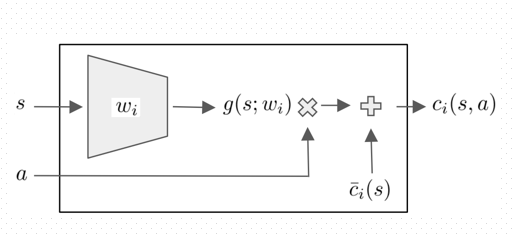

# CS780 Project: Safe Exploration in Continuous Action Spaces

The given repository contains the runs for the safe exploration experiments mentioned in the original paper. The paper essentially talks about a novel architecture employed for solving real world problems where violating safety or critical contraints are heavily penalized. 

There are two environments proposed in the paper for reference, namely the `Ball(n-Dimensional)` and `Spaceship` environments whose dynamics are either modelled by first-order or second-order differential equations respectively. The mentioned solution essentially proposes a **Constrained Marko Decision Process** for modeling the environment dynamics and focuses on constrained policy ptimization where an additional safety-layer is built in top of the original policy calculated from **DDPG (Deep Deterministic Policy Gradient)** layer. The additional safety layer penalizes or avoids the constraints violations and performs an action correction after every policy evaluation. ; i.e., after every policy query,it solves an optimization problem for finding the minimal change to the action such that the safety constraints are met.

### Safety-Layer Diagram

## Project based resources

- [Intro PPT]()
- [Mid-Term Report]()
 

###

|Members | Github-ID |
| --- | --- |
| Rajarshi Dutta | [@Rajarshi1001](https://github.com/Rajarshi1001) |
| Udvas Basak | [@IonUdvas](https://github.com/IonUdvas)|
| Divyani Gaur | [@DivyaniGaur](https://github.com/DivyaniGaur)|

## References

- Dalal, Gal, et al. "Safe exploration in continuous action spaces." arXiv preprint arXiv:1801.08757 (2018).

